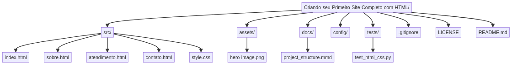

# Clínica Vida Saudável


## 🇧🇷 Português

Este repositório contém o código-fonte de um site estático para uma clínica médica, desenvolvido como parte de um desafio de HTML da DIO. O projeto demonstra a criação de um site responsivo e interativo, utilizando as melhores práticas de desenvolvimento web.

### 🚀 Tecnologias Utilizadas


### 📂 Estrutura do Projeto

```
Criando-seu-Primeiro-Site-Completo-com-HTML/
├── src/
│   ├── index.html
│   ├── sobre.html
│   ├── atendimento.html
│   └── contato.html
├── assets/
│   └── hero-image.png
│   └── project_structure.png
├── docs/
│   └── project_structure.mmd
├── config/
├── tests/
│   └── test_html_css.py
├── .gitignore
├── LICENSE
└── README.md
```

### 📊 Diagrama de Arquitetura



### 📄 Páginas do Site

*   `index.html`: Página principal com uma visão geral da clínica, seus serviços e diferenciais.
*   `sobre.html`: Detalhes sobre a história da clínica, sua missão, visão e valores.
*   `atendimento.html`: Informações sobre os horários de funcionamento, especialidades e agendamento de consultas.
*   `contato.html`: Formulário de contato, endereço, mapa de localização e outras formas de comunicação.

### 🛠️ Como Visualizar e Usar

1.  **Clonar o repositório:**
    ```bash
    git clone https://github.com/galafis/Criando-seu-Primeiro-Site-Completo-com-HTML.git
    ```
2.  **Navegar até o diretório do projeto:**
    ```bash
    cd Criando-seu-Primeiro-Site-Completo-com-HTML
    ```
3.  **Abrir o site:**
    Abra o arquivo `src/index.html` em seu navegador web preferido para começar a navegar pelo site.

### 🤝 Contribuição

Este projeto foi desenvolvido por Gabriel Demetrios Lafis para fins educacionais e como parte de seu portfólio. Contribuições são bem-vindas, mas por favor, entre em contato com o autor antes de fazer grandes alterações.

### 📝 Licença

Este projeto está licenciado sob a Licença MIT. Veja o arquivo [LICENSE](LICENSE) para mais detalhes.

---

## 🇬🇧 English

This repository contains the source code for a static website for a medical clinic, developed as part of a DIO HTML challenge. The project demonstrates the creation of a responsive and interactive website, using web development best practices.

### 🚀 Technologies Used


### 📂 Project Structure

```
Criando-seu-Primeiro-Site-Completo-com-HTML/
├── src/
│   ├── index.html
│   ├── sobre.html
│   ├── atendimento.html
│   └── contato.html
├── assets/
│   └── hero-image.png
│   └── project_structure.png
├── docs/
│   └── project_structure.mmd
├── config/
├── tests/
│   └── test_html_css.py
├── .gitignore
├── LICENSE
└── README.md
```

### 📊 Architecture Diagram


### 📄 Website Pages

*   `index.html`: Main page with an overview of the clinic, its services, and differentiators.
*   `sobre.html`: Details about the clinic's history, mission, vision, and values.
*   `atendimento.html`: Information about operating hours, specialties, and appointment scheduling.
*   `contato.html`: Contact form, address, location map, and other communication methods.

### 🛠️ How to View and Use

1.  **Clone the repository:**
    ```bash
    git clone https://github.com/galafis/Criando-seu-Primeiro-Site-Completo-com-HTML.git
    ```
2.  **Navigate to the project directory:**
    ```bash
    cd Criando-seu-Primeiro-Site-Completo-com-HTML
    ```
3.  **Open the website:**
    Open the `src/index.html` file in your preferred web browser to start browsing the website.

### 🤝 Contribution

This project was developed by Gabriel Demetrios Lafis for educational purposes and as part of his portfolio. Contributions are welcome, but please contact the author before making major changes.

### 📝 License

This project is licensed under the MIT License. See the [LICENSE](LICENSE) file for more details.

